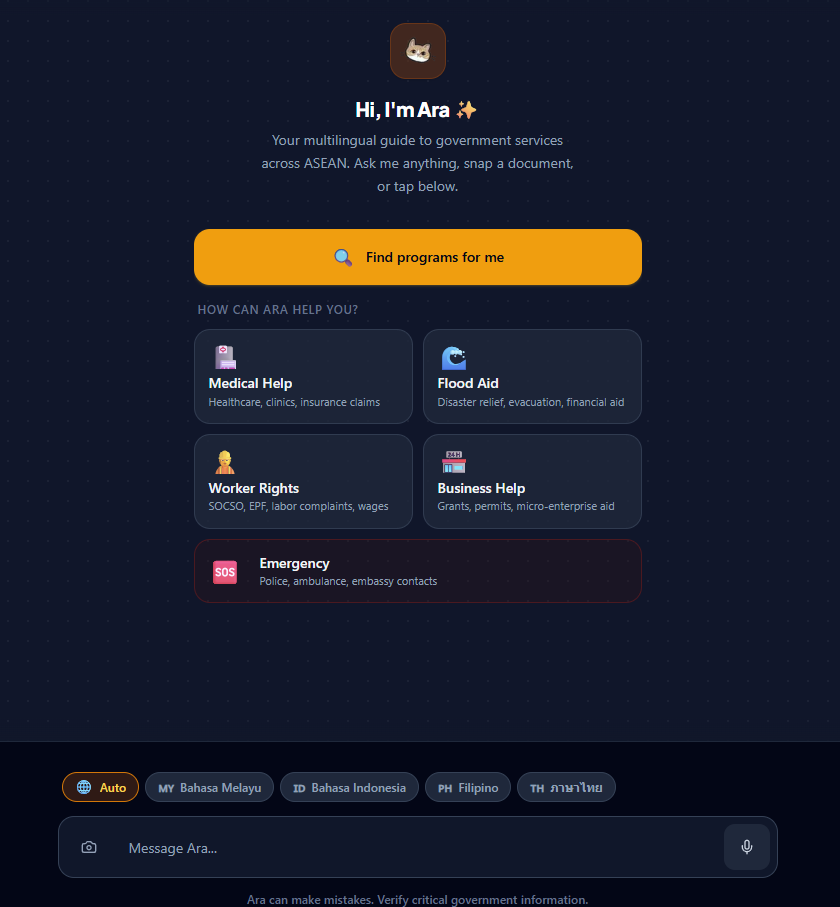
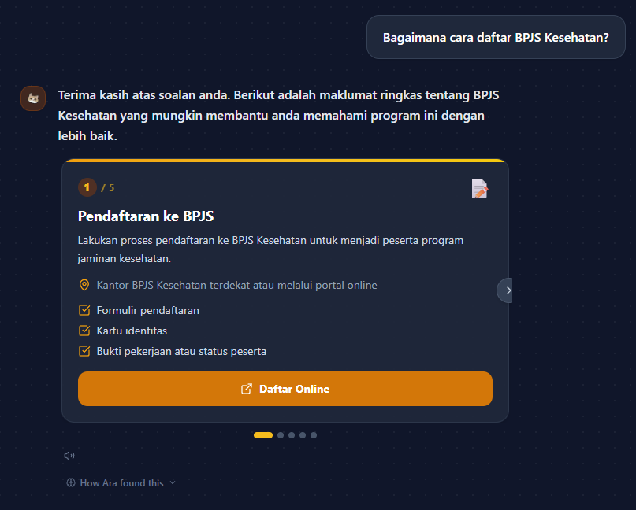
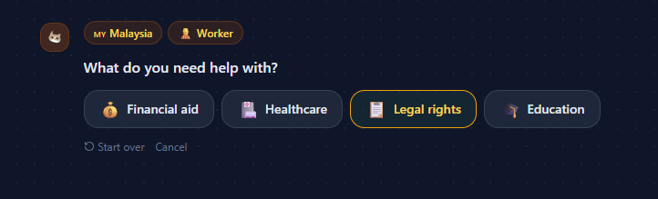
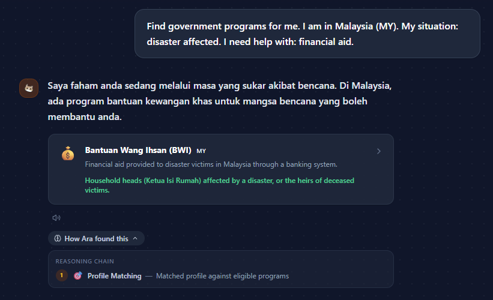
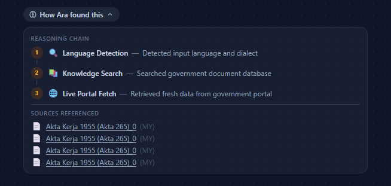
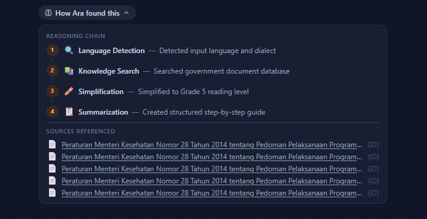
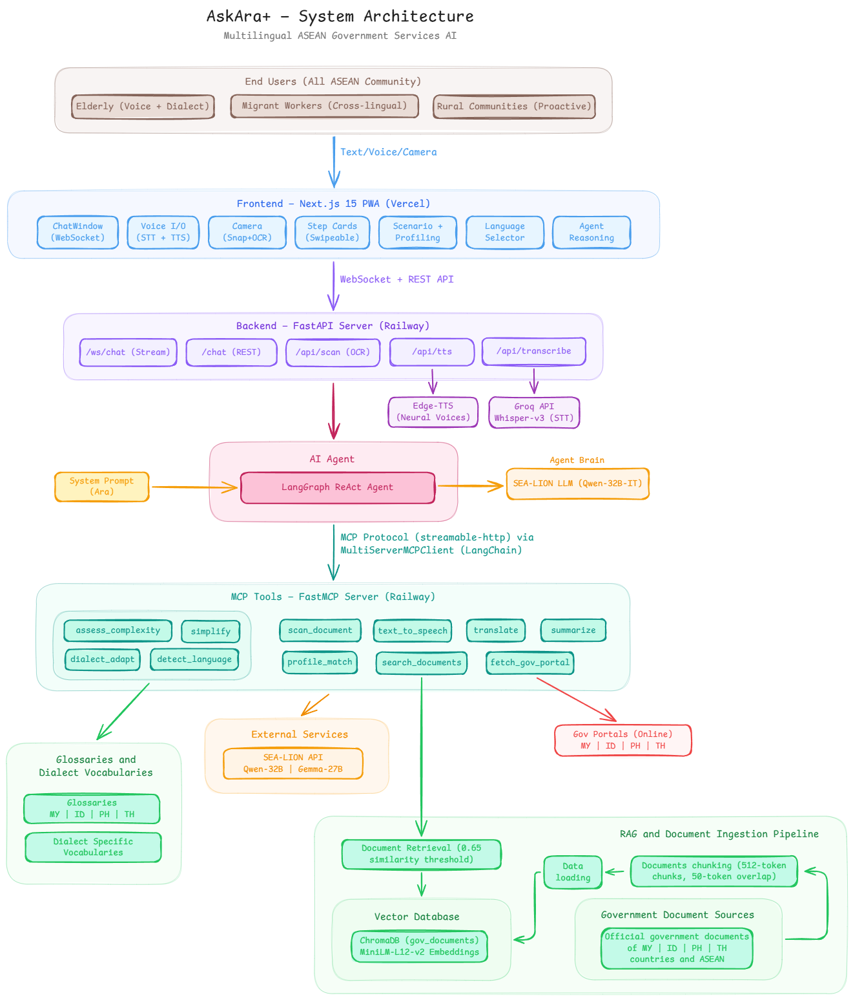

<div align="center">

# AskAra+ ✨

### Multilingual AI Assistant for ASEAN Government Services

**Built by SEA, for SEA.**

<br/>



</div>

---

## The Problem

> 600 million people. Thousands of languages. But across ASEAN, government portals speak just one: **formal, complex, and exclusionary.**

A grandmother in Kelantan can't read her flood relief instructions. An Indonesian domestic worker in Johor Bahru can't check her SOCSO rights. A sari-sari store owner in Leyte can't find the government grant she qualifies for.

Only 47% of ASEAN citizens are considered "highly competent" digitally (ASEAN Foundation, 2023). As government services go digital-first, those who can't navigate the systems lose access to the very safety nets designed for them.

**AskAra+** bridges this gap — not as a chatbot, but as a **proactive digital case worker** that speaks your dialect, reads your government letters, and finds programs you didn't know you qualified for.

---

## Live Demo

**👉 [https://ara.fineeagle.cc](https://ara.fineeagle.cc)**

AskAra+ is deployed as a Progressive Web App (PWA). Open it on your phone, tap "Add to Home Screen", and it works like a native app — no app store needed, offline-capable.

---

## Features

### 🗣️ Multilingual Chat with Code-Switching

Ask in Bahasa Melayu, Bahasa Indonesia, Filipino, Thai, or English — or mix them freely. In ASEAN, nobody speaks just one language. AskAra+ doesn't ask you to pick one either.

> *"Aku nak tanya pasal SOCSO tu, can check online ke?"* — Just works.

### 📸 Snap & Understand

Photograph any government letter or document. AskAra+'s vision model reads it via OCR and explains every section in simple language — in whatever language you prefer.

### 📋 Visual Step Cards

Every response about a government process is rendered as swipeable, actionable step cards — not walls of text. Each card answers: *What do I do? Where do I go? What do I bring?*

<div align="center">

</div>

### 🔍 Proactive Eligibility Agent

Tap **"Find programs for me"** and answer 3 quick questions (country, situation, need). AskAra+ cross-references your profile against all known government programs and recommends ones you qualify for — programs you didn't even know existed.

<div align="center">

<br/>

</div>

### 🌐 Live Government Portal Connector

When the knowledge base doesn't have the answer, AskAra+'s agent autonomously fetches live data from government portals — and flags it as unverified. True agentic behavior, not a hardcoded fallback.

<div align="center">

</div>

### 🧠 Transparent Agent Reasoning

Every response includes a collapsible **"How Ara found this"** panel showing which tools were called, which documents were retrieved, and the full reasoning chain. No black boxes.

<div align="center">

</div>

### 🎙️ Voice Input & Output

Tap the microphone to speak your question. AskAra+ transcribes via Groq Whisper (optimized for ASEAN languages) and reads responses aloud via Edge-TTS neural voices. Designed for elderly users who can't type comfortably.

### 🏳️ Language Auto-Detection

AskAra+ detects your language automatically — including regional dialects like Kelantan Malay and Javanese — and responds in the same language.

---

## Sample Queries to Try

| Scenario | Query | What Happens |
|---|---|---|
| 🇲🇾 Worker rights | `Macam mana nak semak caruman SOCSO saya?` | Retrieves PERKESO docs, simplifies jargon, returns step cards |
| 🇮🇩 Healthcare | `Bagaimana cara daftar BPJS Kesehatan?` | Cross-lingual retrieval, step-by-step registration guide |
| 🇵🇭 Business aid | `Paano mag-apply ng DTI grant for sari-sari store?` | Finds BMBE program, summarizes requirements |
| 🇲🇾 Code-switching | `SOCSO tu apa eh, boleh explain sikit?` | Handles mixed Malay-English naturally |
| 🔍 Proactive | Click **"Find programs for me"** → Malaysia → Worker → Financial aid | Profiles you and recommends matching programs |
| 🇲🇾 Flood relief | `Saya mangsa banjir, bantuan apa yang ada?` | Finds BWI and other disaster relief programs |
| 📸 Snap & Understand | Photograph any government letter → tap camera icon | OCR + explanation in your preferred language |

---

## Architecture

<div align="center">

</div>

### How It Works

AskAra+ uses a **deterministic agent pipeline** — the agent classifies each query into a type (informational, procedural, document scan, profiling, or greeting) and executes a fixed tool chain. SEA-LION is used only for text generation, never for deciding which tools to call. This ensures reliability and consistency.

**Query Pipeline:**

```
User Input → Language Detection → Query Classification
  ├── Type A (Informational) → Search → Simplify → Generate
  ├── Type B (Procedural)    → Search → Simplify → Summarize → Step Cards
  ├── Type C (Document Scan) → OCR → Simplify → Generate
  ├── Type D (Profiling)     → Profile Match → Recommendation Cards
  └── Type E (Greeting)      → Direct LLM response
```

---

## Tech Stack

| Layer | Technology | Purpose |
|---|---|---|
| **Primary LLM** | Qwen-SEA-LION-v4-32B-IT | Text generation — #1 open model for SEA languages |
| **Vision LLM** | Gemma-SEA-LION-v4-27B-IT | Document OCR for Snap & Understand |
| **Embeddings** | `paraphrase-multilingual-MiniLM-L12-v2` | Multilingual vector embeddings (50+ languages) |
| **Vector Store** | ChromaDB | Document retrieval with 0.65 similarity threshold |
| **Backend** | FastAPI (Python) | WebSocket streaming + REST endpoints |
| **MCP Server** | FastMCP | 11 tools exposed via Model Context Protocol |
| **Frontend** | Next.js 15 (PWA) | App Router, TypeScript, Tailwind CSS, shadcn/ui |
| **Voice Input** | Groq Whisper Large v3 | Speech-to-text optimized for ASEAN languages |
| **Voice Output** | Edge-TTS | Neural voice synthesis in multiple ASEAN languages |
| **Deployment** | Docker | Production deployment |

### 11 MCP Tools

| Tool | Function |
|---|---|
| `detect_language` | Identifies language and dialect from user input |
| `search_documents` | RAG retrieval from 2,286 government document chunks |
| `translate` | Cross-lingual translation between ASEAN languages |
| `simplify` | Reduces text complexity to Grade 5 reading level using jargon glossaries |
| `summarize` | Generates structured step-by-step guides as Visual Step Cards |
| `assess_complexity` | Measures text readability level |
| `dialect_adapt` | Adapts standard language to regional dialects (Kelantan, Javanese, etc.) |
| `scan_document` | OCR via vision model for photographed documents |
| `fetch_gov_portal` | Live data retrieval from government websites |
| `profile_match` | Matches user profile to eligible government programs |
| `text_to_speech` | Generates audio output for responses |

### Knowledge Base

- **2,286 document chunks** from official government sources across Malaysia, Indonesia, Philippines, Thailand, and ASEAN-wide publications
- **512-token chunks** with 50-token overlap
- **Metadata schema:** country, topic, language, source agency, document title, effective/expiry dates, document URL
- **Jargon glossaries** for all 4 countries with domain-specific term simplification
- **Dialect vocabularies** for Kelantan Malay, Javanese, Kham Mueang (Northern Thai), and Waray

---

## Project Structure

```
askara/
├── frontend/                   # Next.js 15 PWA (Vercel)
│   ├── public/
│   │   ├── manifest.json       # PWA manifest
│   │   ├── sw.js               # Service worker (offline support)
│   │   └── icons/              # App icons
│   └── src/
│       ├── app/                # Next.js App Router
│       ├── components/         # React components
│       │   ├── ChatWindow.tsx
│       │   ├── MessageBubble.tsx
│       │   ├── StepCards.tsx
│       │   ├── RecommendationCards.tsx
│       │   ├── VoiceInput.tsx
│       │   ├── VoiceOutput.tsx
│       │   ├── CameraCapture.tsx
│       │   ├── LanguageSelector.tsx
│       │   ├── ProfilingFlow.tsx
│       │   ├── ScenarioCards.tsx
│       │   ├── AgentReasoning.tsx
│       │   └── ...
│       ├── hooks/
│       │   └── useWebSocket.ts # WebSocket hook for streaming chat
│       └── lib/
│           ├── types.ts
│           └── utils.ts
│
├── backend/                    # FastAPI + Agent (Railway)
│   ├── server.py               # FastAPI entrypoint (REST + WebSocket + TTS + STT)
│   ├── agent.py                # Deterministic agent pipeline
│   ├── llm_client.py           # SEA-LION API client
│   ├── db.py                   # ChromaDB connection
│   ├── mcp_server.py           # FastMCP server (11 tools)
│   ├── tools/
│   │   ├── search.py           # RAG document retrieval
│   │   ├── language.py         # Language & dialect detection
│   │   ├── translate.py        # Cross-lingual translation
│   │   ├── simplify.py         # Jargon simplification
│   │   ├── summarize.py        # Step card generation
│   │   ├── complexity.py       # Readability assessment
│   │   ├── dialect.py          # Dialect adaptation
│   │   ├── scanner.py          # Document OCR (vision model)
│   │   ├── portal.py           # Live government portal fetch
│   │   ├── profiler.py         # Program eligibility matching
│   │   └── speech.py           # TTS integration
│   ├── prompts/
│   │   └── system_prompt.txt   # Ara's system prompt
│   └── requirements.txt
│
├── data/
│   ├── documents/              # Government document sources
│   ├── glossaries/             # Jargon glossaries (MY, ID, PH, TH)
│   ├── dialects/               # Dialect vocabulary mappings
│   ├── chromadb/               # Vector database (persistent storage)
│   └── scripts/
│       ├── chunk_documents.py
│       ├── load_chromadb.py
│       └── test_retrieval.py
│
├── .env.example
├── README.md
└── architecture.png
```

---

## Getting Started

### Prerequisites

- Python 3.12+
- Node.js 18+
- `uv` (Python package manager)

### Environment Variables

Copy `.env.example` and fill in your API keys:

```bash
# LLM
SEALION_API_KEY=your_key_here
SEALION_API_BASE=https://api.sea-lion.ai/v1
SEALION_MODEL=Qwen-SEA-LION-v4-32B-IT

# Vision model
SEALION_VL_MODEL=Gemma-SEA-LION-v4-27B-IT

# Voice (Groq Whisper)
GROQ_API_KEY=your_key_here

# ChromaDB
CHROMA_PERSIST_DIR=./data/chromadb
CHROMA_COLLECTION=gov_documents

# Frontend
NEXT_PUBLIC_BACKEND_URL=http://localhost:8000
```

### Backend

```bash
cd backend
uv sync
uv run uvicorn server:app --reload --host 0.0.0.0 --port 8000
```

### Frontend

```bash
cd frontend
npm install
npm run dev
```

Open [http://localhost:3000](http://localhost:3000) to use the app locally.

---

## Innovation Highlights

1. **Proactive, not reactive.** AskAra+ doesn't wait for questions — it profiles users and recommends programs they didn't know about. A digital case worker, not a chatbot.

2. **Snap & Understand.** Photograph a government letter, get it explained in your language at Grade 5 reading level. A 10-second feature that transforms accessibility.

3. **Visual Step Cards.** Swipeable, actionable cards designed for low-literacy users — not text walls. UI innovation for real-world inclusivity.

4. **Code-switching as a feature.** ASEAN users mix languages mid-sentence. AskAra+ handles this natively while competitors break.

5. **Built entirely on Southeast Asian AI.** SEA-LION, Gemma-SEA-LION — zero Western LLM dependency. AI sovereignty for the region.

6. **Three-persona, cross-border design.** One architecture serves elderly users, migrant workers, and rural communities across 4 countries. An Indonesian worker in Malaysia asking about Malaysian law in Indonesian — that's the real ASEAN experience.

7. **Transparent reasoning.** Every response shows exactly how Ara found the answer — which tools ran, which documents were retrieved. No black boxes.

8. **Deployed and usable.** A real PWA at [ara.fineeagle.cc](https://ara.fineeagle.cc) — installable on any phone, no app store required.

---

## SDG Alignment

**SDG 10: Reduced Inequalities — Target 10.2**

*"By 2030, empower and promote the social, economic and political inclusion of all, irrespective of age, sex, disability, race, ethnicity, origin, religion or economic or other status."*

AskAra+ directly addresses this by breaking down the language, literacy, and digital barriers that exclude ASEAN's most vulnerable populations from government services they are entitled to.

**Target users:** 10M+ migrant workers, 73M+ elderly citizens, and 340M+ rural populations across ASEAN who face language and digital literacy barriers in accessing government welfare programs.

---

## Countries & Languages Supported

| Country | Languages | Dialects |
|---|---|---|
| 🇲🇾 Malaysia | Bahasa Melayu, English | Kelantan Malay |
| 🇮🇩 Indonesia | Bahasa Indonesia | Javanese |
| 🇵🇭 Philippines | Filipino, English | Waray |
| 🇹🇭 Thailand | Thai | Kham Mueang (Northern Thai) |
